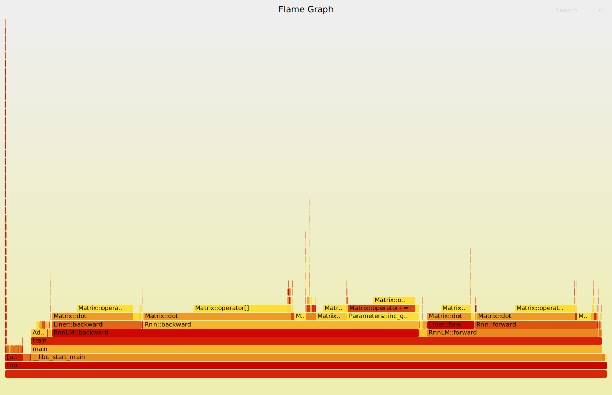

# RNN 语言模型

### pytorch 的输出结果

```
(d2l) cs@cs-desktop:~/project/recognizing_handwritten_digits/c++/rnn$ python test.py 
...
epoch :  24  loss :  1.268025336302514
epoch  25  started.
epoch :  25  loss :  1.2534421859384794
epoch  26  started.
epoch :  26  loss :  1.2397092377418668
epoch  27  started.
epoch :  27  loss :  1.2341045734692153
epoch  28  started.
epoch :  28  loss :  1.2073389064460023
epoch  29  started.
epoch :  29  loss :  1.212782827349819
prefix :  time traveller
predict :  time traveller  fire fole
```

## c++ 输出(训练整篇timemachine_preprocessed.txt 30 轮)

```
(d2l) cs@cs-desktop:~/project/recognizing_handwritten_digits/c++/rnn$ ./rnn 
Data loaded
...
(d2l) cs@cs-desktop:~/project/recognizing_handwritten_digits/c++/rnn$ time ./rnn
Data loaded
epoch 0 loss : 2.00441
epoch 1 loss : 1.95185
epoch 2 loss : 1.93983
epoch 3 loss : 1.92649
epoch 4 loss : 1.92271
epoch 5 loss : 1.92469
epoch 6 loss : 1.92331
epoch 7 loss : 1.92202
epoch 8 loss : 1.91706
epoch 9 loss : 1.91839
epoch 10 loss : 1.92729
epoch 11 loss : 1.92573
epoch 12 loss : 1.9278
epoch 13 loss : 1.93146
epoch 14 loss : 1.92839
epoch 15 loss : 1.93168
epoch 16 loss : 1.93364
epoch 17 loss : 1.92566
epoch 18 loss : 1.92461
epoch 19 loss : 1.92189
epoch 20 loss : 1.9244
epoch 21 loss : 1.92619
epoch 22 loss : 1.93024
epoch 23 loss : 1.92531
epoch 24 loss : 1.92266
epoch 25 loss : 1.9212
epoch 26 loss : 1.92264
epoch 27 loss : 1.91994
epoch 28 loss : 1.92253
epoch 29 loss : 1.92234
prefix : time traveller
predicted :  and and a
prefix : the time machine
predicted :  the the m

real    727m26.765s
user    727m5.501s
sys     0m3.839s
```

```
(d2l) cs@cs-desktop:~/project/recognizing_handwritten_digits/c++/rnn$ ./rnn -e 0 -c ./checkpoints/checkpoint_20250310_102447.bin 
epochs : 0
train by ../../resources/timemachine_preprocessed.txt
epochs : 0
Data loaded
loading from checkpoint : ./checkpoints/checkpoint_20250310_102447.bin
loaded from checkpoint
serving mode
prefix : time traveller
predicted :  for so it will be convenient 
prefix : the time machine
predicted :  by h g wells i the time trave
prefix : expounding a recondite
predicted :  matter to us his grey eyes sh
prefix :  traveller for so
predicted :  it will be convenient to spea
prefix : it has
predicted :  erecondite matter to us his g
prefix : so most people
predicted : res shine by h g wells i the t
prefix : is simply 
predicted : e tam was expounding a recondi
prefix :  we cannot move about
predicted :  and and twankled and his usua
prefix : and the still
predicted :  be convenient to speak of him
```

### perf

