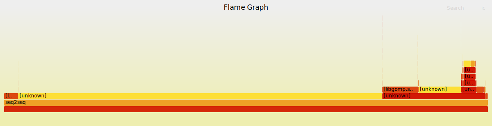

# seq2seq

### training
loss 可以收敛
```
(base) cs@cs-desktop:~/project/recognizing_handwritten_digits/c++/seq2seq$ ./seq2seq -e 50 -f ../../resources/fra_tiny.txt
OMP_THREADS: 8
epochs : 50
dropout : 0.2
lr : 0.005
tiny : 0
data loaded
[300/300]checkpoint saved : ./checkpoints/checkpoint_20250320_193342_0.bin
epoch 0 loss : 26.5325 emit_clip : 3
[300/300]epoch 1 loss : 14.8607 emit_clip : 3
[300/300]epoch 2 loss : 11.229 emit_clip : 2
[300/300]epoch 3 loss : 10.6477 emit_clip : 3
[300/300]epoch 4 loss : 9.92667 emit_clip : 3
[300/300]epoch 5 loss : 9.48985 emit_clip : 2
[300/300]epoch 6 loss : 9.09302 emit_clip : 1
[300/300]epoch 7 loss : 8.65971 emit_clip : 0
[300/300]epoch 8 loss : 8.18512 emit_clip : 1
[300/300]epoch 9 loss : 7.68966 emit_clip : 1
[300/300]checkpoint saved : ./checkpoints/checkpoint_20250320_193342_10.bin
epoch 10 loss : 7.41994 emit_clip : 2
[300/300]epoch 11 loss : 6.89339 emit_clip : 2
[300/300]epoch 12 loss : 6.3686 emit_clip : 1
[300/300]epoch 13 loss : 5.91972 emit_clip : 0
[300/300]epoch 14 loss : 5.56511 emit_clip : 0
[300/300]epoch 15 loss : 5.10425 emit_clip : 0
[300/300]epoch 16 loss : 4.72185 emit_clip : 0
[300/300]epoch 17 loss : 4.35154 emit_clip : 0
[300/300]epoch 18 loss : 4.02221 emit_clip : 0
[300/300]epoch 19 loss : 3.72563 emit_clip : 1
[300/300]checkpoint saved : ./checkpoints/checkpoint_20250320_193342_20.bin
epoch 20 loss : 3.46813 emit_clip : 0
[300/300]epoch 21 loss : 3.23506 emit_clip : 0
[300/300]epoch 22 loss : 3.01653 emit_clip : 0
[300/300]epoch 23 loss : 2.77449 emit_clip : 0
[300/300]epoch 24 loss : 2.58028 emit_clip : 0
[300/300]epoch 25 loss : 2.46159 emit_clip : 0
[300/300]epoch 26 loss : 2.27011 emit_clip : 0
[300/300]epoch 27 loss : 2.11092 emit_clip : 0
[300/300]epoch 28 loss : 1.98888 emit_clip : 0
[300/300]epoch 29 loss : 1.85581 emit_clip : 0
[300/300]checkpoint saved : ./checkpoints/checkpoint_20250320_193342_30.bin
epoch 30 loss : 1.75573 emit_clip : 0
[300/300]epoch 31 loss : 1.63409 emit_clip : 0
[300/300]epoch 32 loss : 1.53708 emit_clip : 0
[300/300]epoch 33 loss : 1.44564 emit_clip : 0
[300/300]epoch 34 loss : 1.37688 emit_clip : 0
[300/300]epoch 35 loss : 1.29316 emit_clip : 0
[300/300]epoch 36 loss : 1.22886 emit_clip : 0
[300/300]epoch 37 loss : 1.16061 emit_clip : 0
[300/300]epoch 38 loss : 1.12776 emit_clip : 0
[300/300]epoch 39 loss : 1.0924 emit_clip : 0
[300/300]checkpoint saved : ./checkpoints/checkpoint_20250320_193342_40.bin
epoch 40 loss : 1.04192 emit_clip : 0
[300/300]epoch 41 loss : 0.99512 emit_clip : 0
[300/300]epoch 42 loss : 0.978948 emit_clip : 0
[300/300]epoch 43 loss : 0.953686 emit_clip : 0
[300/300]epoch 44 loss : 0.928535 emit_clip : 0
[300/300]epoch 45 loss : 0.908949 emit_clip : 0
[300/300]epoch 46 loss : 0.870018 emit_clip : 0
[300/300]epoch 47 loss : 0.860464 emit_clip : 0
[300/300]epoch 48 loss : 0.851943 emit_clip : 0
[300/300]checkpoint saved : ./checkpoints/checkpoint_20250320_193342_49.bin
epoch 49 loss : 0.830455 emit_clip : 0
```

### 推理
```
(base) cs@cs-desktop:~/project/recognizing_handwritten_digits/c++/seq2seq$ ./seq2seq -e 0 -c  ./checkpoints/checkpoint_20250320_193342_49.bin
OMP_THREADS: 8
epochs : 0
dropout : 0.2
lr : 0.005
tiny : 0
data loaded
loading from checkpoint : ./checkpoints/checkpoint_20250320_193342_49.bin
loaded from checkpoint
serving mode
go now . <eos>
translate res : allez-y . <eos>
i try . <eos>
translate res : j'essaye . <eos>
cheers ! <eos>
translate res : santé ! <eos>
get up . <eos>
translate res : lève-toi . <eos>
hug me . <eos>
translate res : serre-moi serre-moi tes tes tes tes tes maison <eos>
i know . <eos>
translate res : sais . <eos>
no way ! <eos>
translate res : en pas ! <eos>
be nice . <eos>
translate res : sois salut refasse avec pompiers pompiers pompiers cervelle farine violemment accorde-moi violemment violemment violemment violemment violemment mondiale mondiale cervelle cervelle
i jumped . <eos>
translate res : j'ai sauté . <eos>
```

### bug 现象记录
1. cat1 没有传导grad
    这时loss依然能够有一定程度的下降，因为反向传播在decoder还工作，但是在cat encoder的ctx和tgt的embedding时断掉了
2. encoder forward token参数传递错误
    这时不能通过全部数据进行调整，所以loss下降到一定程度就不下降了
3. labels的顺序弄错了, 应该是每个step中的token紧挨着，而不是每个句子中的token紧挨着
4. 擅自把hidden和embedding减少到32的效果：模型不易收敛，看起来是表达能力不足，256收敛比较快

### 关于loss

loss=1 是，判断正确的概率是 1/e 约为 36%

想要判断一个token的正确率在50%以上，需要loss下降到 -ln(0.5)以下，也就是0.69以下

想要正确率超过90%，loss需要小于0.105

### 关于参数初始化

由于引入了deep rnn，梯度的问题变得明显
需要用xavier方法初始化weight，针对tanh和sigmoid之前的层初始化的标准差有区别，见代码

### perf

