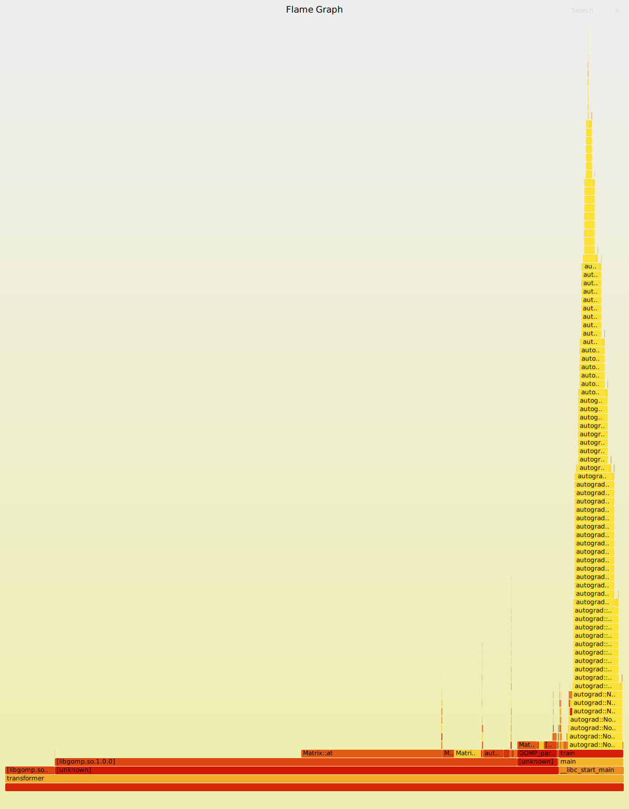

# Transformer

## bug 记录

1. linear 的bias不要全是0，要初始化成随机值打破平衡性，否则不好收敛
2. lr 从 0.005 调整到 0.001 效果很好

## train

初步观察小数据可以收敛

```
(d2l) cs@cs-desktop:~/project/recognizing_handwritten_digits/c++/transformer$ ./transformer -e 10 -f ../../resources/fra_tiny.txt 
OMP_THREADS: 8
epochs : 10
dropout : 0.2
lr : 0.005
tiny : 0
data loaded
parameter size = 21388
[300/300]checkpoint saved : ./checkpoints/checkpoint_20250331_204059_0.bin
epoch 0 loss : 8.38027 emit_clip : 3
[300/300]epoch 1 loss : 4.6412 emit_clip : 3
[300/300]epoch 2 loss : 3.9675 emit_clip : 3
[300/300]epoch 3 loss : 3.90752 emit_clip : 3
[300/300]epoch 4 loss : 3.8816 emit_clip : 3
[300/300]epoch 5 loss : 3.874 emit_clip : 3
[300/300]epoch 6 loss : 3.85435 emit_clip : 3
[300/300]epoch 7 loss : 3.82307 emit_clip : 3
[300/300]epoch 8 loss : 3.81192 emit_clip : 3
[300/300]checkpoint saved : ./checkpoints/checkpoint_20250331_204059_9.bin
```
## preidct

```
(base) cs@cs-desktop:~/project/recognizing_handwritten_digits/c++/transformer$ ./transformer -e 0 -c ./checkpoints/checkpoint_20250402_150847_30.bin
OMP_THREADS: 8
epochs : 0
dropout : 0.2
lr : 0.001
tiny : 0
data loaded
warmUp done
parameter size = 21388
all parameters require_grad = true
loading from checkpoint : ./checkpoints/checkpoint_20250402_150847_30.bin
loaded from checkpoint
serving mode
go now . <eos>
translate res : <bos> allez-y maintenant . <eos>
i try . <eos>
translate res : <bos> j'essaye . <eos>
cheers ! <eos>
translate res : <bos> à votre santé ! <eos>
get up . <eos>
translate res : <bos> lève-toi . <eos>
hug me . <eos>
translate res : <bos> serre-moi dans tes bras ! <eos>
i know . <eos>
translate res : <bos> je sais . <eos>
no way ! <eos>
translate res : <bos> en aucune manière ! <eos>
be nice . <eos>
translate res : <bos> soyez gentilles ! <eos>
i jumped . <eos>
translate res : <bos> j'ai sauté . <eos>
congratulations ! <eos>
translate res : <bos> à ! <eos>
```

## perf
