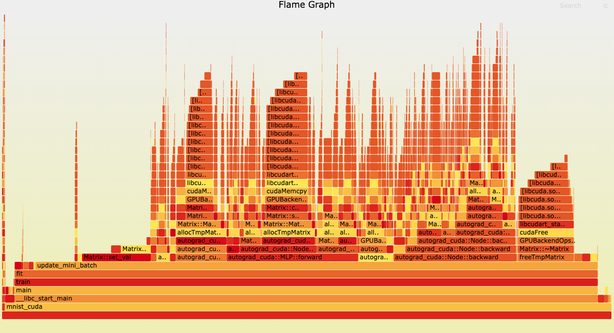

# 手写识别 cuda 版本

## cpu 执行耗时
```
(base) cs@cs-desktop:~/project/recognizing_handwritten_digits/c++/v3$ time ./autogradtest 10 16 1 0
eval : 0
images magic : 2051
label magic : 2049
lables_num : 60000
data loaded.
epoch : [1/10] loss : 0.386355
epoch : [2/10] loss : 0.311789
epoch : [3/10] loss : 0.291745
epoch : [4/10] loss : 0.276773
epoch : [5/10] loss : 0.2731
epoch : [6/10] loss : 0.268525
epoch : [7/10] loss : 0.265325
epoch : [8/10] loss : 0.25371
epoch : [9/10] loss : 0.256684
epoch : [10/10] loss : 0.252679

real    1m59.486s
user    12m39.851s
sys     0m29.523s
```

## gpu 执行耗时
```
(base) cs@cs-desktop:~/project/recognizing_handwritten_digits/c++/v4_cuda$ time ./mnist_cuda 10 16 1 0
eval : 0
images magic : 2051
label magic : 2049
lables_num : 60000
data loaded.
epoch : [1/10] loss : 0.47033
epoch : [2/10] loss : 0.320124
epoch : [3/10] loss : 0.3072
epoch : [4/10] loss : 0.292002
epoch : [5/10] loss : 0.284112
epoch : [6/10] loss : 0.285751
epoch : [7/10] loss : 0.28781
epoch : [8/10] loss : 0.288922
epoch : [9/10] loss : 0.289242
epoch : [10/10] loss : 0.287311

real    0m31.345s
user    0m30.905s
sys     0m0.421s
```

## perf



## todo

* parameter serialize