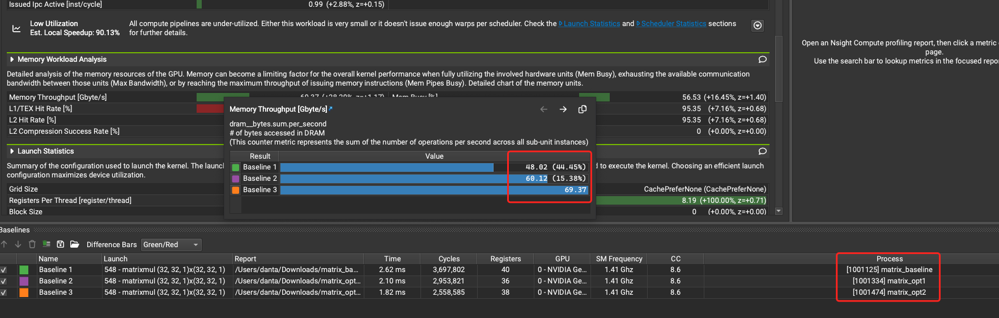

## 参考

* [reduce](https://zhuanlan.zhihu.com/p/426978026)
* [nsight-compute](https://zhuanlan.zhihu.com/p/662012270)
* [nv nsight 官方文档](https://docs.nvidia.com/nsight-compute/NsightCompute/index.html)
* [Warp-level Primitives](https://developer.nvidia.com/blog/using-cuda-warp-level-primitives/)
* [cooperative-groups](https://developer.nvidia.com/blog/cooperative-groups/)
* [share mem](https://developer.nvidia.com/blog/using-shared-memory-cuda-cc/)
* [warp-aggregated](https://developer.nvidia.com/blog/parallelforall/cuda-pro-tip-optimized-filtering-warp-aggregated-atomics/)
* [shuffle 写的不错](https://zhuanlan.zhihu.com/p/669957986)
* [英伟达GPU架构演进近十年，从费米到安培](https://zhuanlan.zhihu.com/p/413145211)
* [bank conflict](https://zhuanlan.zhihu.com/p/659142274)
* [官方 CUDA C++ Programming Guide](https://docs.nvidia.com/cuda/cuda-c-programming-guide/index.html?highlight=bank#)
* [how-do-cuda-blocks-warps-threads-map-onto-cuda-cores](https://stackoverflow.com/questions/10460742/how-do-cuda-blocks-warps-threads-map-onto-cuda-cores)
* [cuda graph](https://developer.nvidia.com/blog/cuda-graphs/)
* [cuda 调试 ](https://zhuanlan.zhihu.com/p/508810115)
* [使用Vscode调试cuda代码](https://fancyerii.github.io/2024/01/17/vscode-cuda-debug/)
* [block grid 维度](???)
* [cuda stream](https://zhuanlan.zhihu.com/p/51402722)

## reduce
### sanitizer

```
/usr/local/cuda/bin/compute-sanitizer ./reduce2
```
### nsight

```
sudo ./run_perf.sh
```

### perf


## matrixmul

### perf

* opt1 share mem
* opt2 prefetch

