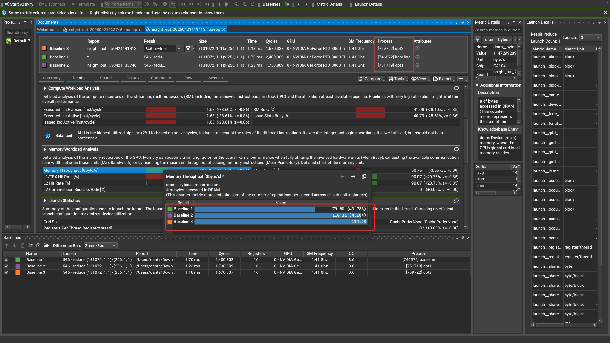

## 参考

* [reduce](https://zhuanlan.zhihu.com/p/426978026)
* [nsight-compute](https://zhuanlan.zhihu.com/p/662012270)
* [nv nsight 官方文档](https://docs.nvidia.com/nsight-compute/NsightCompute/index.html)
* [Warp-level Primitives](https://developer.nvidia.com/blog/using-cuda-warp-level-primitives/)
* [cooperative-groups](https://developer.nvidia.com/blog/cooperative-groups/)

## sanitizer

```
/usr/local/cuda/bin/compute-sanitizer ./reduce2
```
## nsight
```
sudo /usr/local/cuda/nsight-compute-2024.3.2/ncu --set detailed -o /home/cs/project/recognizing_handwritten_digits/build/nsight_out_$(date +%Y%m%d%H%M%S) /home/cs/project/recognizing_handwritten_digits/build/1/baseline

sudo /usr/local/cuda/nsight-compute-2024.3.2/ncu --set detailed -o /home/cs/project/recognizing_handwritten_digits/build/nsight_out_$(date +%Y%m%d%H%M%S) /home/cs/project/recognizing_handwritten_digits/build/1/opt1

sudo /usr/local/cuda/nsight-compute-2024.3.2/ncu --set detailed -o /home/cs/project/recognizing_handwritten_digits/build/nsight_out_$(date +%Y%m%d%H%M%S) /home/cs/project/recognizing_handwritten_digits/build/1/opt2

sudo /usr/local/cuda/nsight-compute-2024.3.2/ncu --set detailed -o /home/cs/project/recognizing_handwritten_digits/build/nsight_out_$(date +%Y%m%d%H%M%S) /home/cs/project/recognizing_handwritten_digits/build/1/opt3

sudo /usr/local/cuda/nsight-compute-2024.3.2/ncu --set detailed -o /home/cs/project/recognizing_handwritten_digits/build/nsight_out_$(date +%Y%m%d%H%M%S) /home/cs/project/recognizing_handwritten_digits/build/1/opt4

sudo /usr/local/cuda/nsight-compute-2024.3.2/ncu --set detailed -o /home/cs/project/recognizing_handwritten_digits/build/nsight_out_$(date +%Y%m%d%H%M%S) /home/cs/project/recognizing_handwritten_digits/build/1/opt5

sudo /usr/local/cuda/nsight-compute-2024.3.2/ncu --set detailed -o /home/cs/project/recognizing_handwritten_digits/build/nsight_out_$(date +%Y%m%d%H%M%S) /home/cs/project/recognizing_handwritten_digits/build/1/opt6
```

## perf
