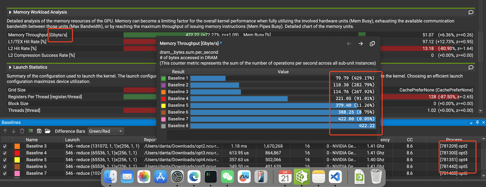

## 参考

* [reduce](https://zhuanlan.zhihu.com/p/426978026)
* [nsight-compute](https://zhuanlan.zhihu.com/p/662012270)
* [nv nsight 官方文档](https://docs.nvidia.com/nsight-compute/NsightCompute/index.html)
* [Warp-level Primitives](https://developer.nvidia.com/blog/using-cuda-warp-level-primitives/)
* [cooperative-groups](https://developer.nvidia.com/blog/cooperative-groups/)
* [share mem](https://developer.nvidia.com/blog/using-shared-memory-cuda-cc/)
* [warp-aggregated](https://developer.nvidia.com/blog/parallelforall/cuda-pro-tip-optimized-filtering-warp-aggregated-atomics/)
* [shuffle 写的不错](https://zhuanlan.zhihu.com/p/669957986)
## sanitizer

```
/usr/local/cuda/bin/compute-sanitizer ./reduce2
```
## nsight

```
sudo ./run_perf.sh
```

## perf
