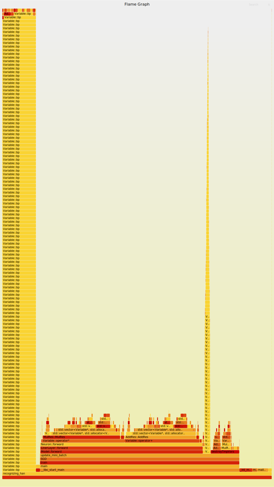
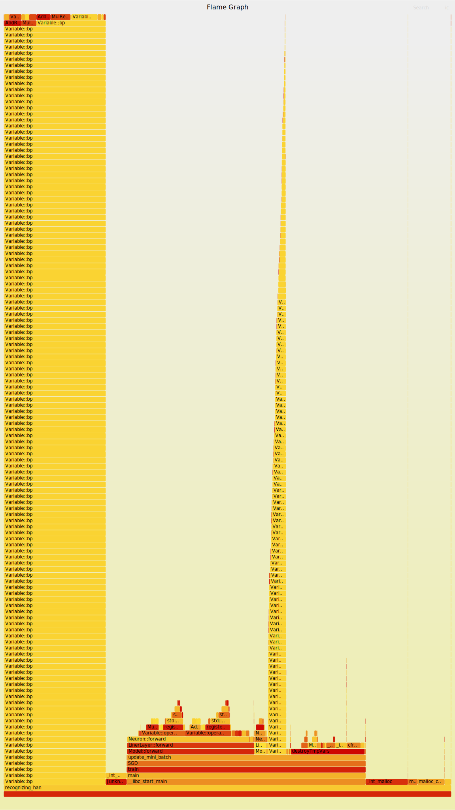

# 自动微分版本

### 遇到的两个坑
1. 计算交叉熵过程中，指数需要减去所有input的最大值，保证不会溢出
2. linerlayer的实现里面，返回的时候不要带relu，想要计算relu就在外面添加relu层

```
(base) cs@cs-desktop:~/project/recognizing_handwritten_digits/v1$ time ./recognizing_handwritten_digits_v1
images magic : 2051
label magic : 2049
lables_num : 60000
data loaded.
epoch : [1/30] update_mini_batch : [1000/5000]
epoch : [1/30] update_mini_batch : [2000/5000]
epoch : [1/30] update_mini_batch : [3000/5000]
epoch : [1/30] update_mini_batch : [4000/5000]
epoch : [1/30] update_mini_batch : [5000/5000]
correct: 8982 / 10000 loss: 0.5461937535
```



第一个版本 vector 的 push_back 的消耗没有必要，直接用数组替换



看起来好了不少